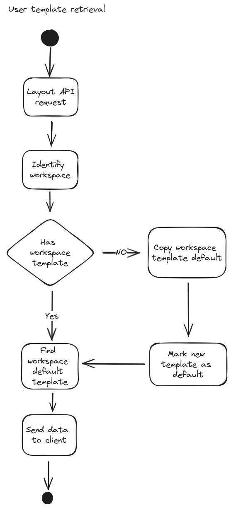
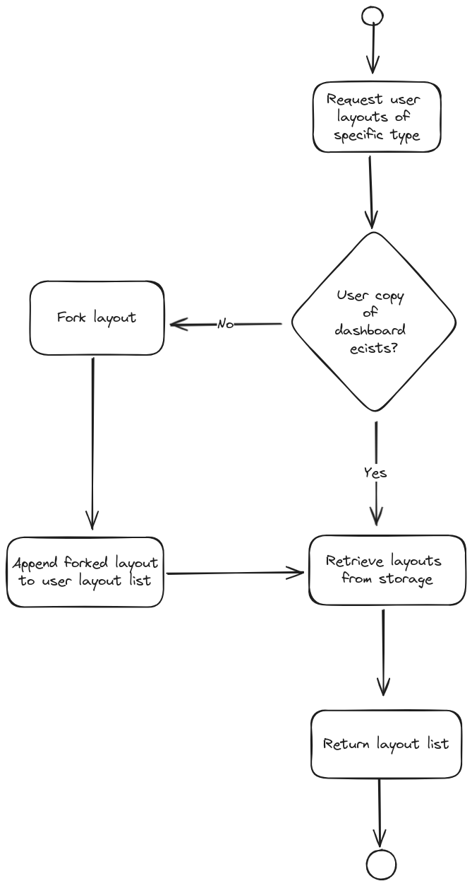

# Dashboard layouts

Store user specific dashboard layouts grid layouts.

## Layout spec

Layout spec is derived from the [react-grid-layout](https://github.com/react-grid-layout/react-grid-layout) project as it is used as the frontend handler.

### Custom attributes

In addition to the default layout config, the user dashboard also needs to identify which frontend modules should be used for each tile in the grid.

The `i` attribute from the [grid item props](https://github.com/react-grid-layout/react-grid-layout#grid-item-props) is used to identify the tile component.

There are to formats the attribute can have:
- \<tile component identifier\>
- \<tile component identifier\>#\<unique-id\>

Each tile in grid requires unique `i` (key). The variant without the unique id exists because a default template must exists from which the rest will be derived. Each tile, regardless of its component type must have a unique ID.

### Layout default

Each user can have one default template per group. The default should be used in the browser as the initial layout config.

## Layout templates

A default template that exists and serves as a base template for every user. This template is stored in a file and can be updated.

On first template requests, if a user does not have any custom template, new is created from the base and the `i` attributes will be modified with a unique generated ID. derived from the user data.

The newly generated template becomes the user default.

Each template will contain 4 variants of the configurations based on various screen sizes.
- sm
- md
- lg
- xl

### Default layout template updates

Updating the default layout **will not update the user templates**. User will be notified about changes regarding to new available tiles.

### Multiple templates

Multiple templates per workspace.

## Layout updates

User are be able to customize the layout. User can customize order of tiles, their size, adding/removing tiles based on a "tile catalog".

Client will sent the whole new layout and the current is discarded. No diff is performed. Its to expensive for such small objects.  

## Multiple layouts

Each user can have multiple layout templates. They can create and remove layouts at will.

## Layout storage

We are dealing with a uniform JSON object. There are no queries made with regard to the actual layout. No significant data is stored from the user POV that would make sense to look through.

The layout is stored as a JSON blob in the database. The entity itself will have name that can be used for filtering.

## Workspaces

*A.K.A. bundles*

Long term goal is to provide these layouts to multiple services, possibly to even have multiple dashboards within a service. Therefore not only user has multiple templates, they can have multiple templates per service.

## Template retrieval



## API

API uses classic CRUD operations. 


### Base layouts

We expect multiple layout types to exist. Currently the only supported type is `landingPage` type as the HCC landing page will be the early adopter.

Base layouts can't be modified via API. Only by changing their definitions.

#### GET `/api/chrome-service/v1/dashboard-templates/base-template`

Returns a list of all available base templates.

#### GET `/api/chrome-service/v1/dashboard-templates/base-template?dashboard=landingPage`

Returns a single template for a specific dashboard type.

### User specific layout

#### Layout modification restrictions

Actions that in any way modify layouts, are restricted. Only user that "owns" a layout can make any changes to it.

The modification flow is following.


#### Creating layouts

*applies for initial implementation*

User cannot create custom layouts. User can create layouts based on the base layouts, or copy existing layouts.

If a user does not have a layout of a specific type, that personal layout will be created when a user requests specific layout type for the first type by "forking" the current version of the base layout. Subsequent requests will return user owned layouts.




To retrieve or initialize list of specific dashboard category there is a following endpoint.

This layout will also be marked as default.

```
GET /api/chrome-service/v1/dashboard-templates?dashboard=<layout-type>
```

#### Retrieve layouts

#### Specific layout type

```
GET /api/chrome-service/v1/dashboard-templates?dashboard=<layout-type>
```

#### All user owned layouts

```
GET /api/chrome-service/v1/dashboard-templates
```

#### Updating layouts

The [Layout modification restrictions](#Layout-modification-restrictions) apply to this action

The only mutable attributes of a layout is the react-grid-layout config. Rest of attributes are immutable.

If a request with changed immutable attributes is sent, these changes are discarded and only the grid config is updated.


Update endpoint

```
PATCH /api/chrome-service/v1/dashboard-templates/<template-id>
```

#### Removing layout

The [Layout modification restrictions](#Layout-modification-restrictions) apply to this action

Delete endpoint

```
DELETE /api/chrome-service/v1/dashboard-templates/<template-id>
```

The entity is "soft removed". The record will remain in the BD but is not retrieved by the ORM.

**FUTURE option**

Monitor the size if the DB and see if it "bloats". If that is the case, hard remove the entries.

Either with reach request or have a cron job that will remove old (several weeks?) records in batch.

Potentially think about feature to restore removed (archived) layouts.

#### Copy layout

Another way to create a layout is to duplicate existing layout.

The user **does not have to own the layout** to copy it. 

This may change in the future once the layout sharing feature will be added.

The only restriction is the existence of the original layout.

```
POST /api/chrome-service/v1/dashboard-templates/<template-id>/copy
```

### Changing layout group default config

The [Layout modification restrictions](#Layout-modification-restrictions) apply to this action

Only one layout per layout type can be marked as default.


### Widgets mapping

To access the mapping of widgets to respective module federation metadata, use the mapping get endpoint.

```
GET /api/chrome-service/v1/dashboard-templates/widget-mapping

```

Response format

```TS
type AvailableWidgets = "FavoriteServices" | "NotificationsEvents" | "LearningResources" | "RecentlyVisited" | "ExploreCapabilities" | "Edge" | "Ansible" | "Red Hat Enterprise Linux" | "OpenShift" | "Quay.io" | "OpenShift AI" | "Advanced Cluster Security" | "My support cases"

type WidgetHeaderLink = {
  title?: string;
  href?: string;
}

type WidgetConfig = {
  title: string;
  icon?: string;
  headerLink: WidgetHeaderLink;
}

type WidgetMappingResponse = {
  data: {
    [key in AvailableWidgets]: {
      scope: string;
      module: string;
      importName?: string; // if undefined default export will be used
      config: WidgetConfig;
    }
  }
}

```

### Dashboard layout encode/decode/sharing

A layout can be shared via importing a base64 encoded layout

#### Encoding layout

Only layout owner can encode a layout. Call the encode get endpoint

```
GET /api/chrome-service/v1/dashboard-templates/<template-id>/encode
```

#### Decoding layout

Any authenticated user can decode any shared string. Call the decode post endpoint.

The payload is validates and verifies if the layout is valid. Nothing is persisted in DB during this operation.

```
POST /api/chrome-service/v1/dashboard-templates/decode

{
  "encodedTemplate": <base64 encoded layout>
}
```
